# Heathrow Inn
A responsive hotel website built with **React.js** and **Bootstrap 5**.  
It includes a clean, modern UI for hotel services, rooms, gallery, and contact information.

## Features
- Beautiful hero section with background image
- Rooms and services cards
- Gallery section
- Responsive design for mobile and desktop
- Social media integration

## Screenshots

### Desktop View

#### Hero Section
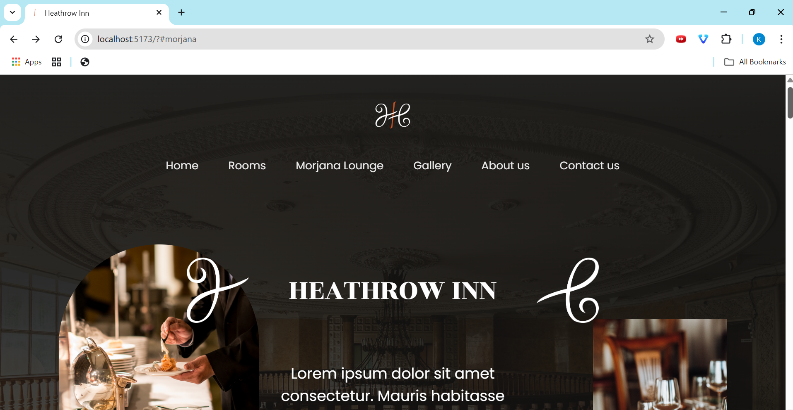
#### Amenities Section
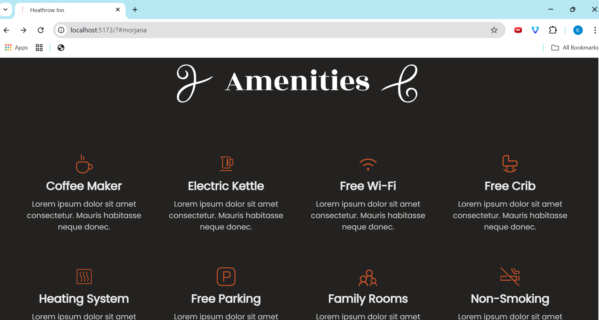
#### Rooms Section
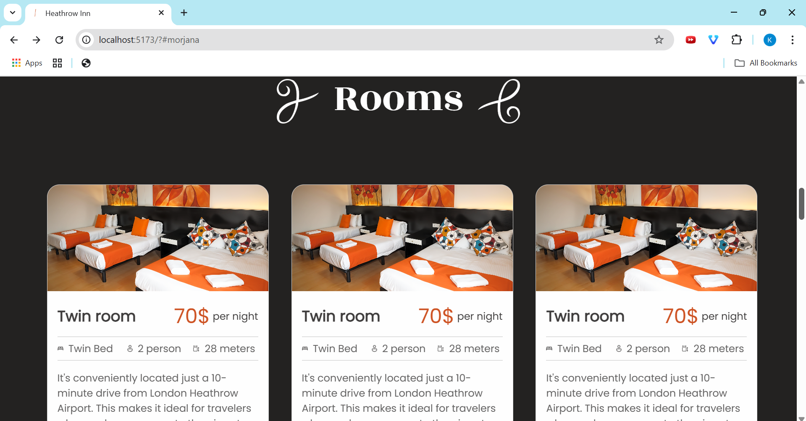
#### Morjana Lounge Section

#### Conatct Us Section
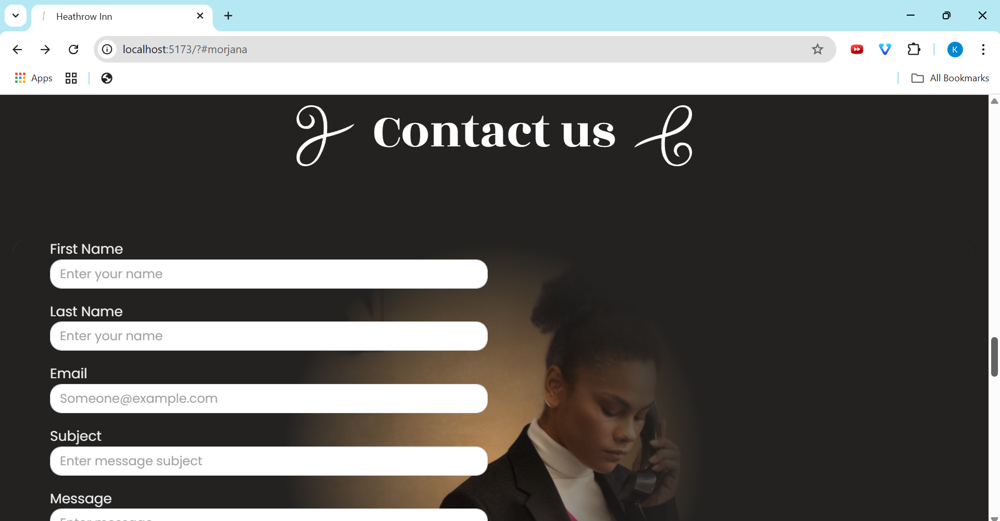
#### Gallery Section
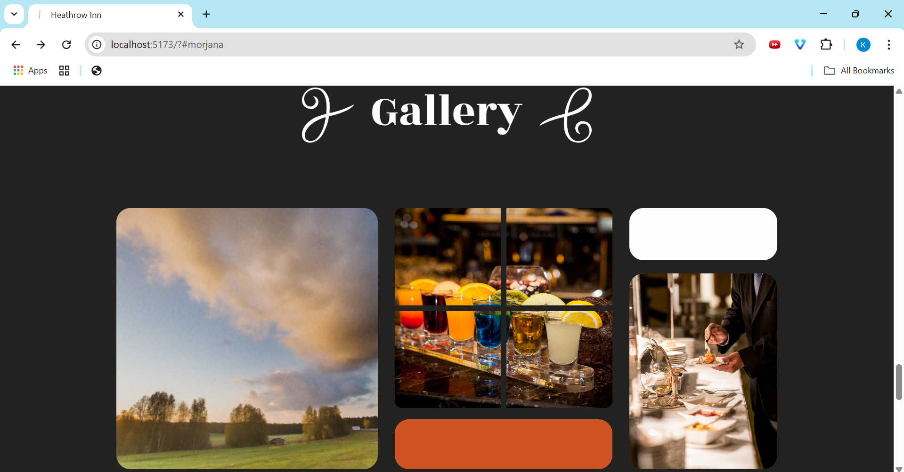
#### About Us Section
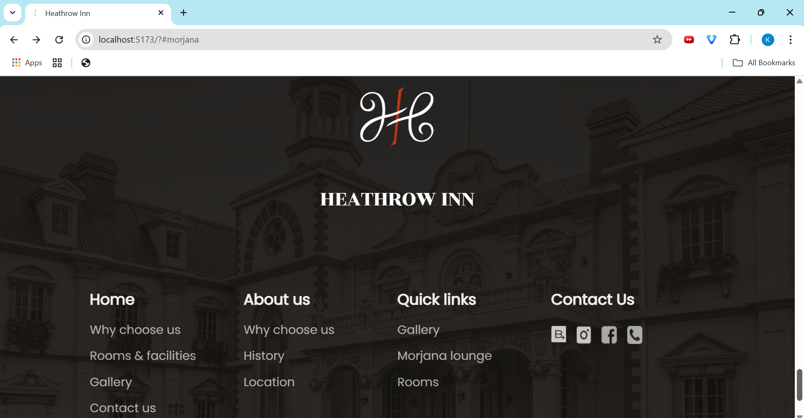

### Mobile View

#### Hero Section
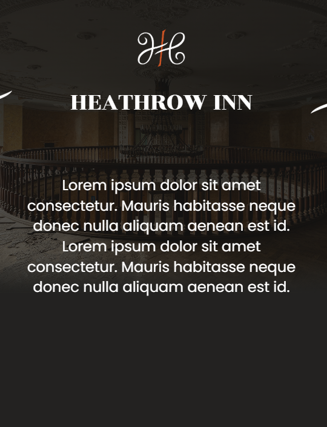
#### Amenities Section
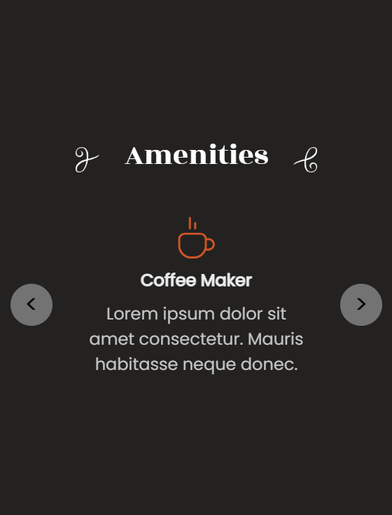
#### Rooms Section
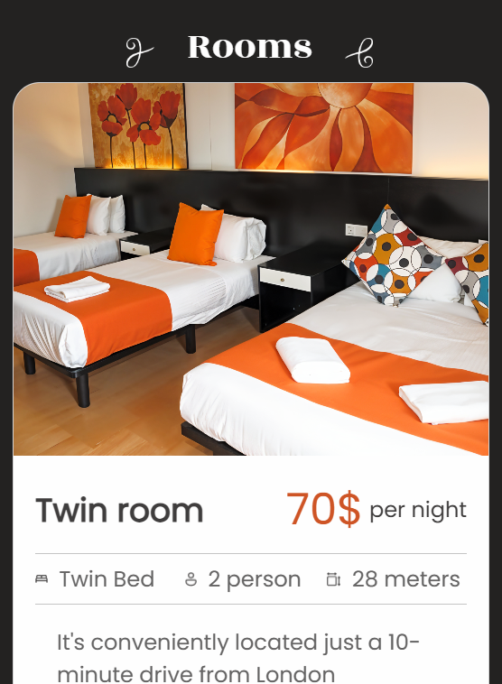
#### Morjana Lounge Section

#### Contact Us Section
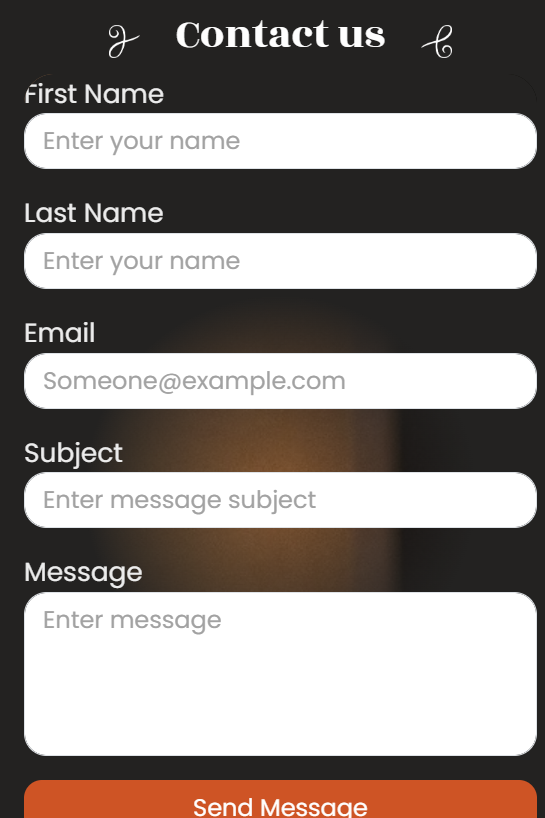
#### Gallery Section
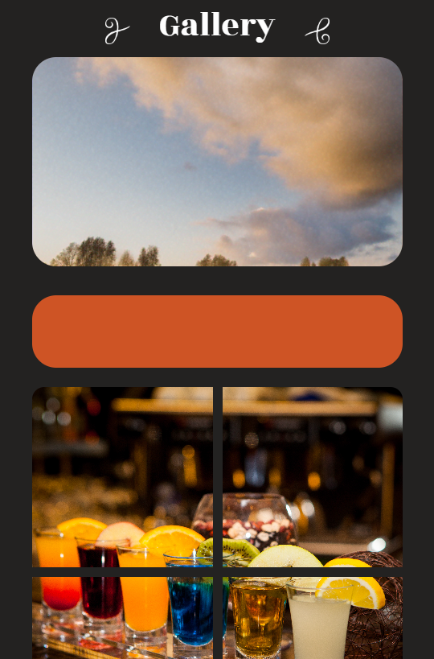
#### About us Section
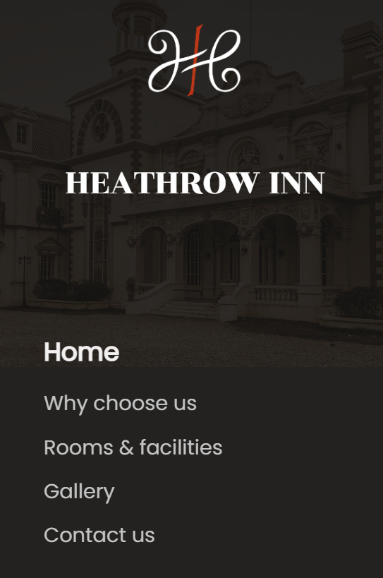
#### Footer
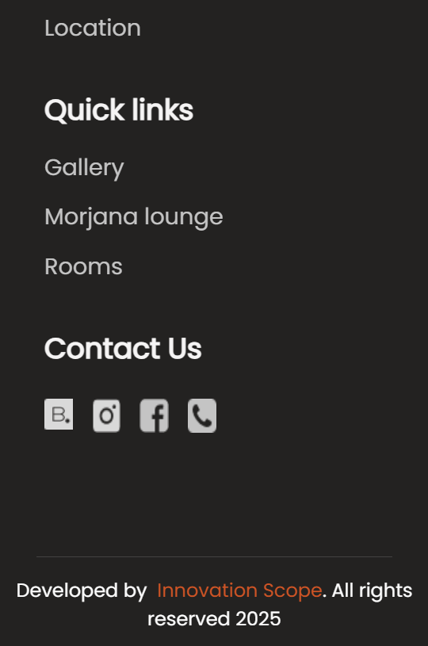

## Technologies
- React.js
- Bootstrap 5
- HTML5 + CSS3

## Author
[Kermina Wasfy](https://github.com/Kermina-Wasfy)

